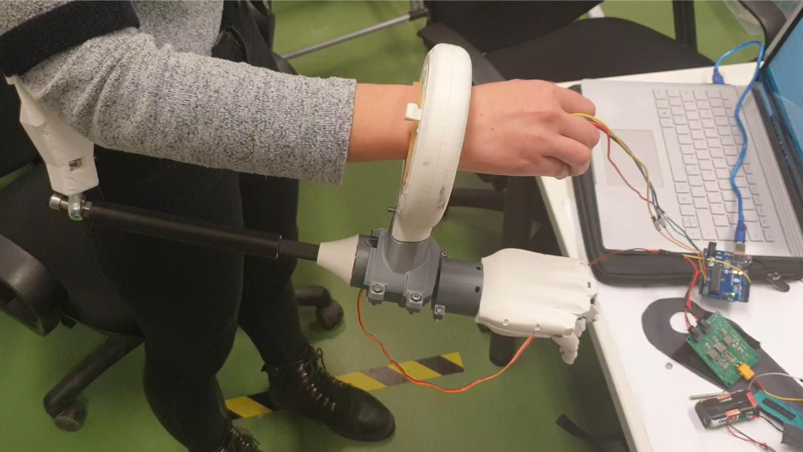

# Wrist Design for a Modular Transradial Bypass Socket for Prosthetic Control in Non-Amputees
Voluntary research internship in cooperation with the [Institute for Cognitive Systems](https://www.ce.cit.tum.de/ics/home/) during the Bachelor`s study in [Engineering Science](https://www.tum.de/en/studies/degree-programs/detail/engineering-science-bachelor-of-science-bsc). During the internship, which should be completed from the 3rd semester at the earliest and must have a scope of 120 working hours (of which at least 80 h are actual research activities and approx. 40 h are the preparation of a research report or a poster), the students of the Bachelor of Engineering Science program have the opportunity to gain an insight into specific research fields at TUM in the company of experienced scientific staff.

## Abstract
The wrist plays a crucial role in human movement and manipulation of the hand, which makes a prosthetic wrist one of the most important components in the design of a prosthetic device. At the Institute of Cognitive Systems, a 3D-printed wrist for a modular upper-limb bypass socket was developed during a research internship that can easily be customized for use with a variety of terminal devices. Through bypass sockets, researchers can test a prosthetic system from the point of view of a prosthetic user. The designed wrist can perform sufficient range of motions and torques to complete easy tasks in everyday life, and can be used at the university for research and experiments on prosthetic devices

## Demo

  

